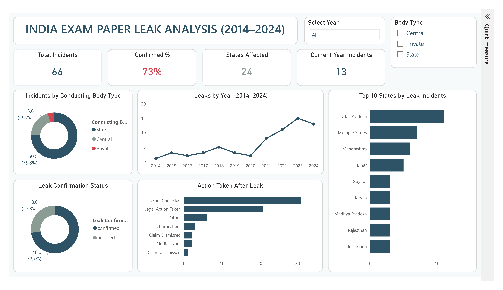

# Exam Paper Leak Analysis — India (2014–2024)

An end-to-end data analysis project examining exam paper leak incidents across India, from raw data cleaning to an interactive Power BI dashboard.



## Project Overview

This project analyzes 66 recorded exam paper leak incidents in India between 2014 and 2024, covering state, central, and private examination bodies. The goal was to clean real-world, messy data and turn it into a clear, decision-ready dashboard.

**Tools used:**
- **Python (Pandas)** — data cleaning and preprocessing
- **Power Query** — transformation within Power BI
- **Power BI** — data modeling, DAX measures, and dashboard visualization

## Key Insights

1. **Sharp increase in recent years** — Average incidents per year rose from ~2.7 (2014–2020) to ~11.8 (2021–2024), a **4.3x increase**.
2. **State-level exams are the most affected** — **75.8%** of incidents occurred in State-conducted exams, compared to 19.7% Central and 4.5% Private.
3. **Uttar Pradesh is the most affected state**, with 11 recorded incidents — the highest of any state.
4. **Most cases are confirmed, not just alleged** — **72.7%** of incidents were officially confirmed leaks.
5. **The typical response is reactive** — Exam cancellation was the most common action taken (30+ cases), with comparatively few preventive security reforms recorded.

## Folder Structure

```
exam-paper-leak-dashboard/
│
├── raw_data/           # Original, unprocessed dataset
├── clean_data/          # Cleaned dataset (output of Pandas processing)
├── notebooks/           # Pandas data cleaning script/notebook
├── powerbi/              # Power BI (.pbix) dashboard file
├── screenshots/         # Dashboard and chart screenshots
├── insights/             # Summary insights (Excel)
└── README.md
```

## Data Cleaning (Pandas)

Raw data was cleaned and standardized using Pandas before being loaded into Power BI. Key steps included:
- Removing duplicate/inconsistent state name spellings
- Standardizing categorical values (e.g., leak confirmation status, action taken)
- Extracting Year, Month, and Quarter fields from the incident date
- Handling missing or inconsistent entries

See [`notebooks/`](notebooks/) for the full cleaning process.

## Dashboard Features

The Power BI dashboard (single page) includes:
- **KPI Cards** — Total Incidents, Confirmed %, States Affected, Current Year Incidents
- **Trend Chart** — Year-wise incident trend (2014–2024)
- **Top States Bar Chart** — States with the highest number of incidents
- **Conducting Body Type** — Breakdown by State / Central / Private
- **Leak Confirmation Status** — Confirmed vs. Accused cases
- **Action Taken** — Response breakdown after each leak
- **Slicers** — Filter by Year and Conducting Body Type

## How to View

1. Download `powerbi/Paper_Leaks_Dashboard.pbix`
2. Open with [Power BI Desktop](https://powerbi.microsoft.com/desktop/) (free)

## Data Source

Compiled from publicly available news reports (2014–2024).

---

*This project is for educational and portfolio purposes.*
